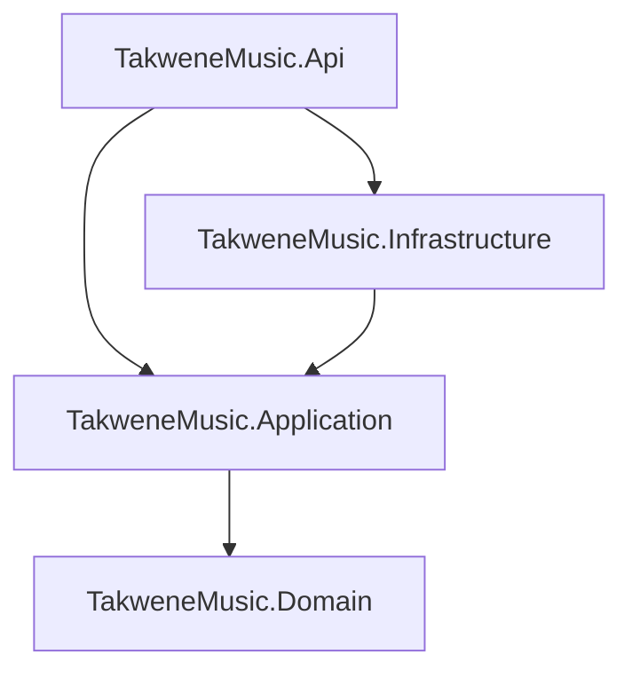

# 🎵 TakweneMusic — Music & Track Distribution Platform

TakweneMusic is a modern, high-performance web API built with **.NET 10** designed for managing artists, DSPs (Digital Service Providers), tracks, and track distributions. The application is built using the principles of **Clean Architecture** and follows the **CQRS (Command Query Responsibility Segregation)** pattern for scalability, maintainability, and clean code separation.

---

## 🚀 Key Features

*   **Clean Architecture**: Separation of concerns into Domain, Application, Infrastructure, and API layers.
*   **CQRS with MediatR**: Segregated Read (Query) and Write (Command) pipelines.
*   **Minimal APIs with Carter**: Clean and modularized route definitions instead of bloated controllers.
*   **Pure Input Validation**: Centralized FluentValidation pipeline utilizing MediatR pipeline behaviors to enforce input and structural validity before reaching handlers.
*   **Centralized Global Exception Handling**: Centralized `IExceptionHandler` mapping exceptions to standard RFC 7807 `ProblemDetails` output.
*   **Secure Authentication & Identity**: Built on top of ASP.NET Core Identity Core supporting robust JWT Access Token issuance and Refresh Token rotation mechanisms.
*   **Unified Responses**: Standardized JSON response payload structure via a generic `ApiResponse<T>` wrapper.
*   **OpenAPI Documentation**: Automatically generated interactive documentation and testing sandbox via **NSwag**.
*   **PostgreSQL & Entity Framework Core**: Strong, structured data relational storage utilizing migration mapping.

---

## 🏛️ Architecture Overview

The solution adheres strictly to **Clean Architecture** where the core business logic (Domain and Application) is isolated from external dependencies like database access and UI frameworks.



### 📂 Folder Structure

```text
src/
├── TakweneMusic.Domain/          # Core entities, Enums, and Domain Logic
├── TakweneMusic.Application/     # Commands, Queries, Handlers, Validators, DTOs, interfaces
├── TakweneMusic.Infrastructure/  # EF Core DbContext, Identity Services, Refresh Token logic
└── TakweneMusic.Api/             # Web API Host, Modular Endpoints, Global Exception Middleware
```

---

## 🛠️ Technology Stack

*   **Runtime**: [.NET 10.0](https://dotnet.microsoft.com/)
*   **Routing Framework**: [Carter](https://github.com/CarterCommunity/Carter)
*   **Mediator Pattern**: [MediatR](https://github.com/jbogard/MediatR)
*   **Validation**: [FluentValidation](https://fluentvalidation.net/)
*   **Database ORM**: [Entity Framework Core](https://learn.microsoft.com/en-us/ef/core/)
*   **Database Provider**: [Npgsql PostgreSQL](https://www.npgsql.org/efcore/)
*   **API Spec Generation**: [NSwag](https://github.com/RicoSuter/NSwag)

---

## 🔒 Standard API Response Format

Every successful API response is wrapped in a generic `ApiResponse<T>` envelope:

```json
{
  "isSuccess": true,
  "message": "Request completed successfully.",
  "data": {
    "id": "3fa85f64-5717-4562-b3fc-2c963f66afa6",
    "name": "Artist Name",
    "email": "artist@example.com"
  }
}
```

In case of validation failures or runtime exceptions, the API returns a structured **Problem Details** representation according to RFC 7807:

```json
{
  "type": "https://tools.ietf.org/html/rfc7231#section-6.5.1",
  "title": "Validation Error",
  "status": 400,
  "detail": "One or more validation failures occurred.",
  "errors": {
    "Email": [
      "'Email' is not a valid email address."
    ]
  }
}
```

---

## 📡 API Endpoints

### 🔐 Authentication & Security (Anonymous Access)
*   `POST /api/auth/register` — Register a new user
*   `POST /api/auth/login` — Sign in and receive JWT and Refresh Token
*   `POST /api/auth/refresh` — Rotate/renew tokens with a Refresh Token

### 🎨 Artists (Authentication Required)
*   `GET /api/artists` — Retrieve list of artists
*   `GET /api/artists/{id}` — Get single artist details
*   `POST /api/artists` — Create a new artist profile
*   `PUT /api/artists/{id}` — Update existing artist profile
*   `DELETE /api/artists/{id}` — Remove an artist

### 🖥️ DSPs (Authentication Required)
*   `GET /api/dsps` — Retrieve list of Digital Service Providers (e.g. Spotify, Apple Music)
*   `GET /api/dsps/{id}` — Get single DSP details
*   `POST /api/dsps` — Add a new DSP
*   `PUT /api/dsps/{id}` — Update existing DSP
*   `DELETE /api/dsps/{id}` — Remove a DSP

### 🎵 Tracks (Authentication Required)
*   `GET /api/tracks` — Query/filter tracks by genre or artist
*   `POST /api/tracks` — Create/upload a new track

### 📊 Track Distributions (Authentication Required)
*   `GET /api/track-distributions` — View all distributions
*   `GET /api/track-distributions/{id}` — Get details of a distribution task
*   `POST /api/track-distributions` — Distribute a track to a DSP
*   `PUT /api/track-distributions/{id}` — Update distribution status
*   `DELETE /api/track-distributions/{id}` — Cancel a distribution

---

## ⚙️ Configuration & Setup

### Prerequisites
*   [.NET SDK 10.0](https://dotnet.microsoft.com/download/dotnet/10.0)
*   [PostgreSQL Database Server](https://www.postgresql.org/)

### 1. Database Connection
Update the connection string in `src/TakweneMusic.Api/appsettings.json`:
```json
"ConnectionStrings": {
  "Database": "Host=localhost;Port=5432;User Id=postgres;Password=YOUR_PASSWORD;Database=TakweenDB"
}
```

### 2. Apply Migrations
Apply EF Core migrations to prepare your schema and seed initial lookup data:
```bash
dotnet ef database update --project src/TakweneMusic.Infrastructure --startup-project src/TakweneMusic.Api
```

### 3. Run the Project
```bash
dotnet run --project src/TakweneMusic.Api/TakweneMusic.Api.csproj
```
The API will start and host by default at `http://localhost:5023`.

### 4. Interactive OpenAPI UI
Navigate to `http://localhost:5023/swagger` in your web browser to explore and test the endpoints via the NSwag Swagger UI. Apply authorization using the `Bearer {your_jwt_token}` format.
