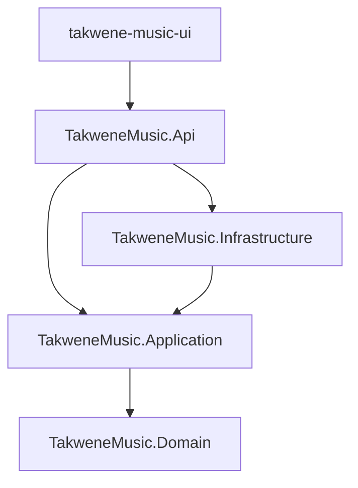
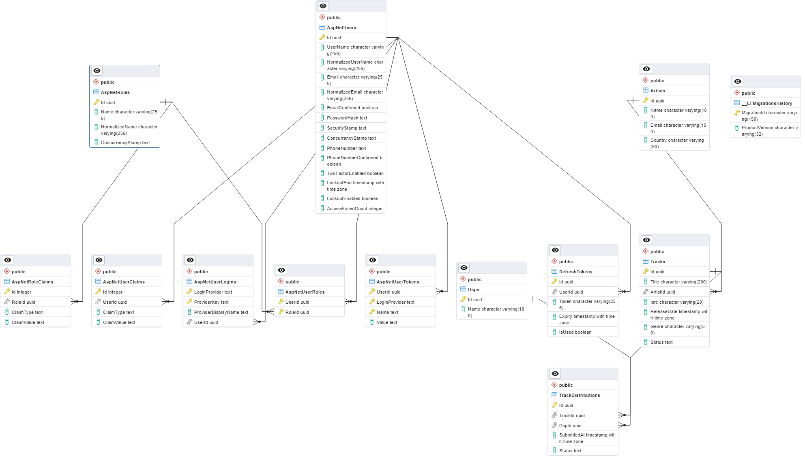

# 🎵 TakweneMusic — Enterprise Music & Track Distribution Platform

TakweneMusic is a modern, high-performance music and track distribution platform consisting of a robust **.NET 10 Web API** backend and a responsive **React + Vite** frontend. Built using the principles of **Clean Architecture** and the **CQRS (Command Query Responsibility Segregation)** pattern, the system offers a highly scalable, maintainable, and secure foundation for managing artists, DSPs (Digital Service Providers), tracks, and track distributions.

---

## 🏛️ Architecture & Clean Design

The platform strictly adheres to **Clean Architecture** to ensure the core business domain is entirely isolated from external dependencies, frameworks, databases, and UI implementations.



### 📂 Repository Directory Structure

```text
TakweneMusic/
├── TakweneMusic.slnx                 # Solution Definition
├── Schema.png                        # Database Diagram Visual
├── Dockerfile                        # Multi-stage Production Docker configuration
│
├── src/                              # Backend Solution Code
│   ├── TakweneMusic.Domain/          # Core Business Entities, Value Objects, and Enums
│   ├── TakweneMusic.Application/     # CQRS Commands/Queries, Handlers, Validators, DTOs, Interfaces
│   ├── TakweneMusic.Infrastructure/  # EF Core AppDbContext, PostgreSQL Configs, JWT Issuer, Identity Core
│   └── TakweneMusic.Api/             # Web Host, Reflection Endpoints, Exception Middleware, OpenAPI
│
└── takwene-music-ui/                 # Frontend React Application
    ├── public/                       # Static Assets
    ├── src/
    │   ├── api/                      # Axios Client API wrappers and Query Client
    │   ├── components/               # Domain-specific UI Managers (Artists, Tracks, DSPs, Auth, etc.)
    │   ├── context/                  # Auth and Theme Global Contexts
    │   └── main.jsx                  # Application Bootstrap
    ├── package.json                  # Dependencies (Tailwind CSS, React Query, Axios)
    └── vite.config.js                # Vite Bundler Config
```

---

## 🚀 Key Architectural Decisions

### 1. Dynamic Reflection-Based Endpoint Registry
To maintain a modular layout without standard bloated Controllers or third-party libraries (e.g. Carter), we implemented a custom registry:
- **`IEndpointGroup`**: A simple interface (`void MapEndpoints(IEndpointRouteBuilder app)`) deployed across domain feature directories.
- **Dynamic Startup Discovery**: On startup, `Program.cs` uses Reflection to scan the Api assembly, instantiates classes implementing `IEndpointGroup`, and automatically mounts them onto the pipeline using `app.MapGroup()`.
- **Swagger Integration**: Group mappings automatically apply correct OpenApi metadata using `.WithTags()` to guarantee segmented OpenAPI client sandboxes.

### 2. Bypassing the Repository Pattern
We chose not to implement a traditional generic Repository layer on top of Entity Framework Core. Since EF Core's `DbSet` and `DbContext` already serve as a robust Repository and Unit of Work, adding another abstraction adds boilerplate. Instead, MediatR handlers interact directly with the abstracted `IApplicationDbContext` interface.

### 3. Separation of Input Validation from Relational Checks (Thin Validators)
To resolve dependency injection lifetime issues (e.g. Scoped db context inside a Singleton validator) and speed up response times:
- **FluentValidation**: Confined strictly to pure structural/input validation (format, required fields, patterns) run synchronously in a scoped MediatR pipeline.
- **MediatR Handlers**: Carry out database validation check logic (e.g. checking if an entity exists, unique index validation) and throw structured business exceptions on failure.

### 4. Global Exception Interceptor & Standard RFC 7807 problem details
Rather than spreading fragile `try-catch` blocks across Minimal APIs, an ASP.NET Core `IExceptionHandler` intercepts all unhandled runtime or validation errors. It formats and returns them following the RFC 7807 standard response structure.

---

## 🛠️ Technology Stack

### Backend (API)
*   **Core Runtime**: [.NET 10.0](https://dotnet.microsoft.com/)
*   **Mediator Pattern**: [MediatR](https://github.com/jbogard/MediatR)
*   **Validation**: [FluentValidation](https://fluentvalidation.net/)
*   **Database ORM**: [Entity Framework Core](https://learn.microsoft.com/en-us/ef/core/)
*   **Database Provider**: [Npgsql PostgreSQL](https://www.npgsql.org/efcore/)
*   **OpenAPI Generator**: [NSwag](https://github.com/RicoSuter/NSwag)

### Frontend (UI)
*   **Framework**: [React](https://react.dev/) (built with [Vite](https://vitejs.dev/))
*   **Styling**: [Tailwind CSS](https://tailwindcss.com/)
*   **State Management & Caching**: [React Query](https://tanstack.com/query/latest) (TanStack)
*   **HTTP Client**: [Axios](https://axios-http.com/)

---

## 📊 Database Schema

The database model tracks users, authentication refresh states, artists, musical tracks, Digital Service Providers (DSPs), and track delivery targets.



> [!NOTE]
> **Audit Integrity Decision**: The relationship between `Track` and `TrackDistribution` uses a nullable foreign key (`TrackId` is `Guid?`) with `DeleteBehavior.SetNull`. If a track is deleted, the historical distribution auditing records are preserved for billing and analytics.

---

## 📡 API Endpoint Registry

All secured endpoints require authentication via standard JWT Bearer tokens.

### 🔐 Authentication & Identity
*   `POST /api/auth/register` — Register new application users
*   `POST /api/auth/login` — Sign in to acquire JWT access tokens and secure HTTP rotation refresh tokens
*   `POST /api/auth/refresh` — Renew tokens through refresh token rotation logic

### 🎨 Artists
*   `GET /api/artists` — Fetch all artist profiles
*   `GET /api/artists/{id}` — Fetch detailed artist profile
*   `POST /api/artists` — Register a new artist
*   `PUT /api/artists/{id}` — Edit an artist profile
*   `DELETE /api/artists/{id}` — Delete an artist

### 🖥️ DSPs (Digital Service Providers)
*   `GET /api/dsps` — Get supported DSP list (e.g. Spotify, Deezer, Apple Music)
*   `POST /api/dsps` — Register a new DSP target
*   `PUT /api/dsps/{id}` — Edit DSP configuration
*   `DELETE /api/dsps/{id}` — Remove a DSP

### 🎵 Tracks
*   `GET /api/tracks` — Query catalog tracks, filtered optionally by genre or artist ID
*   `POST /api/tracks` — Register a new music track with valid ISRC metadata

### 📊 Track Distributions
*   `GET /api/track-distributions` — View historical and active track delivery streams
*   `POST /api/track-distributions` — Distribute a track to a target DSP (tracks state changes to Distributed)
*   `PUT /api/track-distributions/{id}` — Update delivery state
*   `DELETE /api/track-distributions/{id}` — Remove or cancel a distribution pipeline

---

## 🔒 Standard API Response Envelope

Successful requests return a standardized envelope structure:

```json
{
  "isSuccess": true,
  "message": "Request completed successfully.",
  "data": {
    "id": "e969d7b5-0c15-4659-9943-41c38fa802cc",
    "title": "Starlight",
    "isrc": "US-RC1-23-45678",
    "genre": "Synthwave"
  }
}
```

Validation errors map automatically to `400 Bad Request` Problem Details:

```json
{
  "type": "https://tools.ietf.org/html/rfc7231#section-6.5.1",
  "title": "Validation Error",
  "status": 400,
  "detail": "One or more validation failures occurred.",
  "errors": {
    "Isrc": [
      "'Isrc' must be in a valid standard ISRC format (e.g., US-RC1-23-45678)."
    ]
  }
}
```

---

## ⚙️ Configuration & Setup

### Prerequisites
*   [.NET SDK 10.0](https://dotnet.microsoft.com/download/dotnet/10.0)
*   [Node.js (v18+) & npm](https://nodejs.org/)
*   [PostgreSQL Database Server](https://www.postgresql.org/)

---

### 1. Database Connection Configuration
Open `src/TakweneMusic.Api/appsettings.json` (or `appsettings.Development.json`) and configure your connection details:
```json
"ConnectionStrings": {
  "Database": "Host=localhost;Database=TakweenDB;Username=postgres;Password=YOUR_POSTGRES_PASSWORD"
}
```

### 2. Database Migrations Execution
Apply Entity Framework migration scripts to generate database tables and seed Initial DSPs:
```bash
dotnet ef database update --project src/TakweneMusic.Infrastructure --startup-project src/TakweneMusic.Api
```

### 3. Running the Backend API
```bash
dotnet run --project src/TakweneMusic.Api/TakweneMusic.Api.csproj
```
The server will start at `http://localhost:5023`. To access the interactive OpenAPI Sandbox UI, navigate to `http://localhost:5023/swagger`.

### 4. Running the Frontend SPA
Navigate to the UI folder, install dependencies, and launch Vite dev server:
```bash
cd takwene-music-ui
npm install
npm run dev
```
Open the local developer interface in your browser at `http://localhost:5173`.
